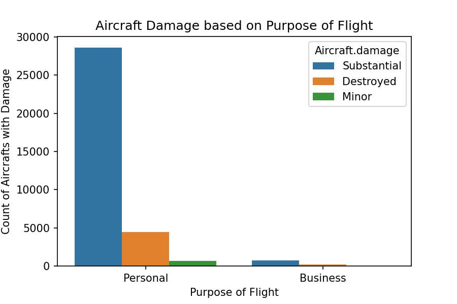
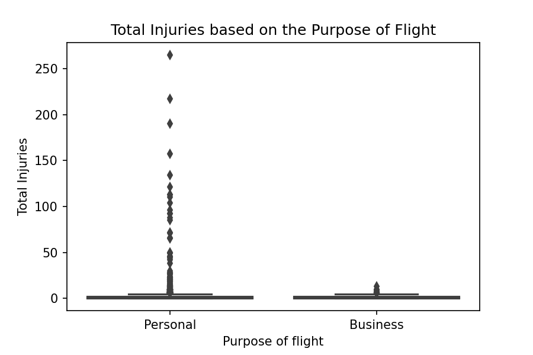
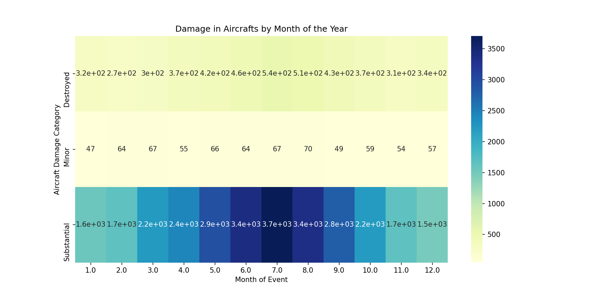

# Aircraft Acquisition Proposal

## Overview:
I have conducted a data analysis with the aim of providing 
recommendations for the optimal aircraft selection to ensure a 
successful business venture. This analysis is grounded in three key 
recommendations and factors crucial for evaluating the viability of 
initiating such a business endeavor.

## Business Understanding: 
The company is exploring the operation of airplanes for both commercial and private enterprises. The forthcoming data 
analysis is designed to assist the company in identifying aircraft 
with the lowest risk profile, aiding in the informed decision-making 
process for the initiation of this new business endeavor.

## Data Understanding:

**Source of data:** For this analysis I will be using the 
[dataset](https://www.kaggle.com/datasets/khsamaha/aviation-accident-database-synopses) 
from the National Transportation Safety Board that includes aviation 
accident data from 1962 to 2023 about civil aviation accidents and 
selected incidents in the United States and international waters.

**Description of data:**
The dataset contains 90,348 rows of data and 31 columns.

**Visualizations:**

Tableau Dashboard Link [Here](https://public.tableau.com/app/profile/adriana.ramirez.franco/viz/AircraftProposalDashboard/Dashboard?publish=yes).

## Conclusion
In summary, the analysis recommends the acquisition of airplanes 
with multiple turbo engines for increased power, speed, and safety 
during longer trips. Emphasizing airplanes designed for commercial 
purposes is advisable, given their lower risks and accident rates, 
enhanced affordability, and broader market reach. Additionally, the 
analysis highlights the importance of strategically reducing flights 
during the riskier months of June, July, and August in the Central 
regions of the US to mitigate overall risk.

## More Information
Find the full analysis in the [Jupyter Notebook](./AircraftAcquisitionProposalFinal.ipynb) or review this [presentation](./AircraftAcquisitionProposalPresentation.pdf).

## 
Repository Structure

├── Data
├── Graphs
├── ArcraftAcquisitionProposalFinal.ipynb
├── README.md
└── AircraftAcquisitionProposalPresentation.pdf

